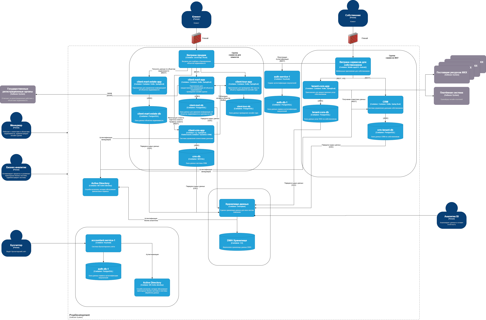

# Текущее состояние архитектуры
У компании доменная структура. Каждый домен отвечает за часть бизнеса и состоит из ряда продуктовых команд. Всего в PropDevelopment четыре домена:
Группа сервисов для продаж. Сюда входит пять приложений: витрина продаж, client-tour-app (приложение для онлайн-тура), client-mart-app (приложение для онлайн-сделки), client-crm-app (система для управления клиентскими данными) и client-mart-estate-app (приложение для управления данными о недвижимости). У всех приложений, кроме витрины, есть собственная база данных.
Группа сервисов ЖКУ. Они отвечают за предоставление услуг собственникам. Сюда входит витрина, tenant-core-app (сервис для предоставления услуг) и его БД, а также CRM, которая управляет данными о собственниках, и её БД.
Финансы. В этот домен входит система финансового учёта — accountant-service-1, а также её БД и служба каталогов.
Дата — группа сервисов, которые отвечают за обработку данных. Сюда входит хранилище, BI и отчётность.

